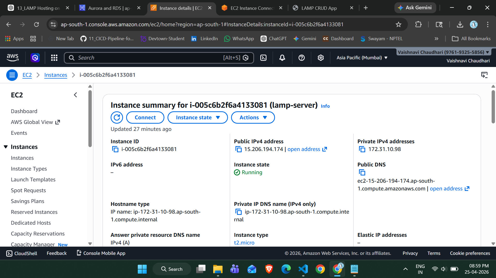
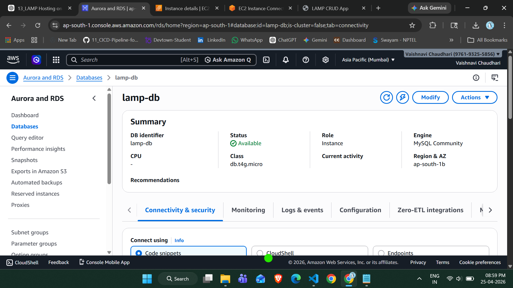
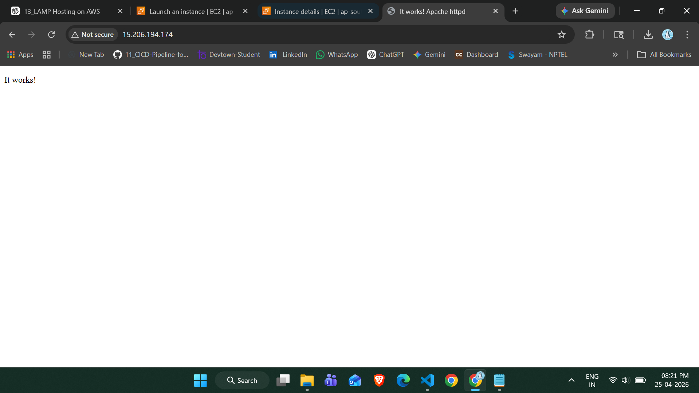
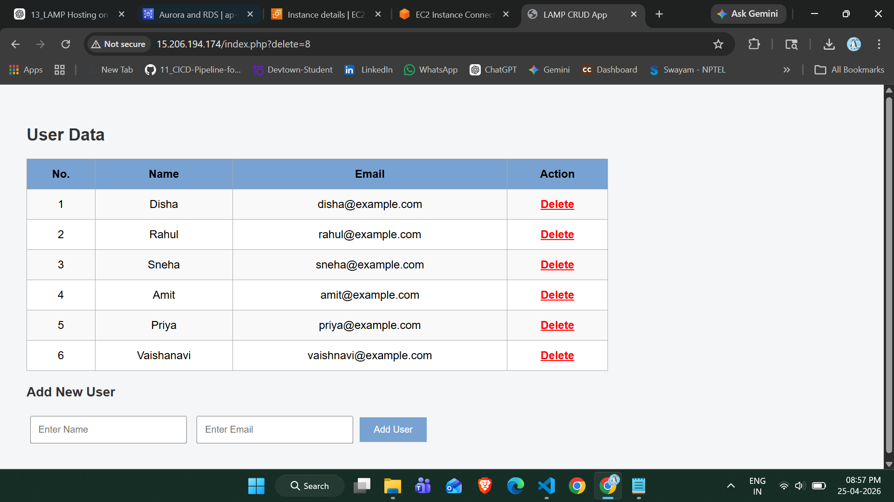

# 🚀 LAMP Stack CRUD Application on AWS

## 📌 Project Overview

This project demonstrates the deployment of a **LAMP (Linux, Apache, MySQL, PHP) stack application on AWS** using EC2 and RDS.

It is a dynamic **CRUD (Create, Read, Delete)** web application that allows users to manage data stored in an AWS RDS MySQL database.

---

## 🎯 Objectives

* Deploy a web server using EC2 (Linux)
* Configure Apache and PHP
* Create and connect a MySQL database using RDS
* Build a dynamic PHP CRUD application
* Enable secure communication between EC2 and RDS

---

## 🧰 AWS Services Used

* **EC2 (Elastic Compute Cloud)** – Hosting the web server
* **RDS (Relational Database Service)** – Managed MySQL database
* **Security Groups** – Control inbound/outbound traffic

---

## 🏗️ Architecture

```
User (Browser)
     ↓
EC2 (Apache + PHP)
     ↓
RDS (MySQL Database)
```

---

## ⚙️ Step-by-Step Implementation

### 🔹 Step 1: Launch EC2 Instance

* Amazon Linux 2023
* Instance type: t2.micro
* Open ports:

  * 22 (SSH)
  * 80 (HTTP)

---

### 🔹 Step 2: Install Apache & PHP

```bash
sudo dnf update -y
sudo dnf install httpd php php-mysqlnd -y
sudo systemctl start httpd
sudo systemctl enable httpd
```

---

### 🔹 Step 3: Create RDS Database

* Engine: MySQL
* DB Name: lampdb
* Port: 3306
* Public access: Enabled (for testing)

---

### 🔹 Step 4: Connect EC2 to RDS

```bash
mysql -h <RDS-ENDPOINT> -u admin -p
```

---

### 🔹 Step 5: Create Database & Table

```sql
CREATE DATABASE lampdb;
USE lampdb;

CREATE TABLE users (
    id INT AUTO_INCREMENT PRIMARY KEY,
    name VARCHAR(50),
    email VARCHAR(50)
);
```

---

### 🔹 Step 6: Build PHP CRUD Application

* Display user data in table format
* Add new users
* Delete users
* Serial number display (UI-friendly)

---

## 🖼️ Screenshots

### 🖥️ EC2 Instance



---

### 🗄️ RDS Database



---

### 🌐 Apache Test Page



---

### 🎯 Final Output (Main Result)



---

## 🎯 Features

* Dynamic data fetching from RDS
* Add user functionality
* Delete user functionality
* Clean UI with table format
* Auto-updating serial numbers

---

## ⚠️ Challenges Faced

* SSH key permission issues (Windows)
* MySQL client installation on Amazon Linux 2023
* Security group configuration for EC2 ↔ RDS
* PHP not executing initially

---

## ✅ Solution Highlights

* Used `dnf` instead of `yum` (Amazon Linux 2023)
* Configured proper inbound rules (port 3306)
* Installed required PHP modules
* Implemented UI-based serial numbering

---

## 🚀 Future Enhancements

* Update/Edit functionality
* Login authentication system
* Bootstrap UI improvements
* Deployment with custom domain & HTTPS

---

## 🙌 Conclusion

This project demonstrates end-to-end deployment of a scalable web application using AWS cloud services and highlights key DevOps and backend development concepts.

---

